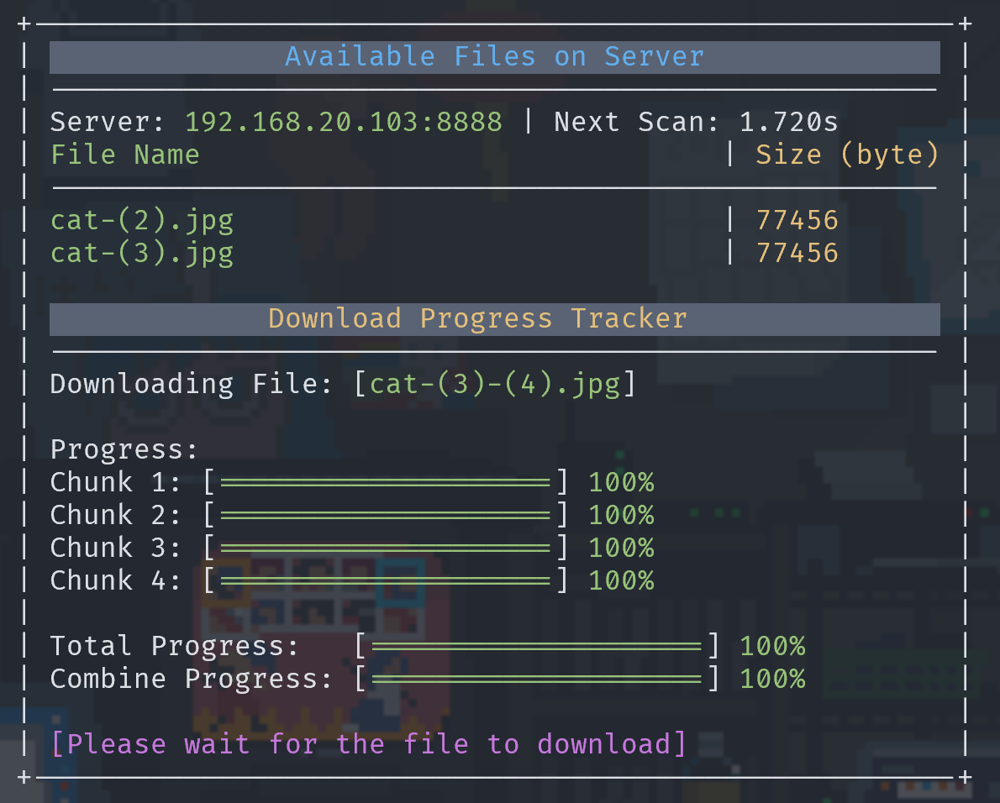
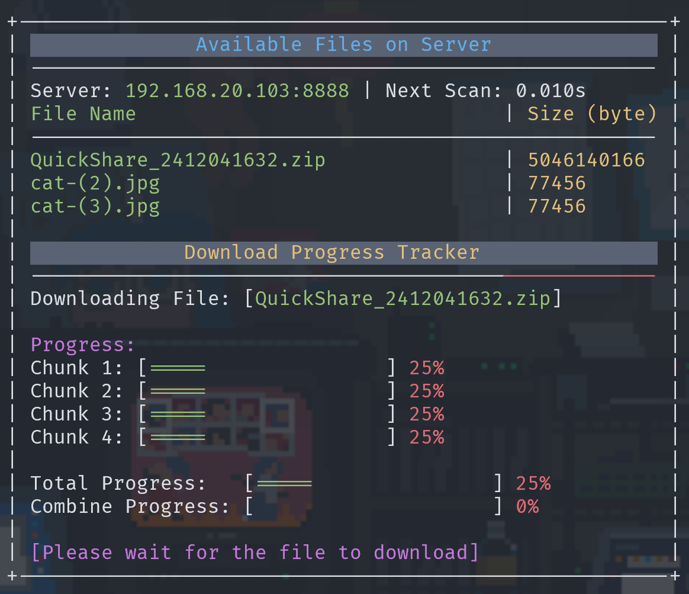

# NETWORKING WITH WINSOCK

---

## Build and Run

**Build:**

```bat

cd ./TCP-Redo
./build all

// or ./build client
// or ./build server
```

**Run server:**

```bat

// from TCP
cd ./server
./server.exe <ip> <port>

```

**Run client:**

```bat

// from TCP
cd ./client
./client.exe <ip> <port>
```

## Client UI

The UI is a simple Terminal UI, it will show the progress of the download and the download speed. Also the time remaining for next time it scans the `input.txt`.

**Ascii Art**

```powershell
 +-------------------------------------------------------+
 |               Available Files on Server               |
 | ----------------------------------------------------- |
 | Server: 192.168.20.103:8888 | Next Scan: 2.670s       |
 | File Name                               | Size (byte) |
 | ----------------------------------------------------- |
 | QuickShare_2412041632.zip               | 5046140166  |
 | cat     -   (2).jpg                     | 77456       |
 | cat-(3).jpg                             | 77456       |
 |                                                       |
 |              Download Progress Tracker                |
 | ----------------------------------------------------- |
 | Downloading File: [QuickShare_2412041632-(3).zip]     |
 |                                                       |
 | Progress: 678.64 MB | 4.69 GB                         |
 | Chunk 1: [===                 ] 13%                   |
 | Chunk 2: [===                 ] 14%                   |
 | Chunk 3: [===                 ] 14%                   |
 | Chunk 4: [===                 ] 13%                   |
 |                                                       |
 | Total Progress:   [===                 ] 14%          |
 | Combine Progress: [                    ] 0%           |
 |                                                       |
 | [Please wait for the file to download]                |
 +-------------------------------------------------------+
```

**Image demo**



When the client start the program, set says using the command `./client 192.168.20.103 8888`, it first fetch the available files from the server, shows to the user. then it will start downloading the files. The files will be saved in the `./client/Files` folder.


When the file is dowloaded, notify will tell the user can press ctrl + c to exit the program. While it download, it will tell the user wait for the program to download.



Example of the program running downloading big files.

---

## Client Protocol

### 1. Connect to the Server

Establish a TCP connection to the server.

---

### 2. Get the List of Files from the Server

**Function**: `get_file_list(...)`

#### Steps:

1. **Send a "GET_LIST" Request**  
   The client requests the server to provide a list of available files.
2. **Receive File Information**  
   - Call `receive_file(...)` to retrieve the file list.  
   - Steps in `receive_file(...)`:
     - Receive a file transfer packet containing confirmation and file information.
     - Send an "OK" message back to the server.
     - Open the `ready.txt` file on the client's computer to store the list.
     - Receive and write file data in a `while` loop.
     - Close the file after successfully receiving and writing the content.

---

### 3. Download Files

**Function**: `handle_download(...)`

#### Steps:

1. **Scan the Input File (`input.txt`)**  
   -Check if any new line added then read the file list to identify the names of files to download.
2. **Download Each File**  
   For each new file added in `input.txt`, perform the following:
   - Call `handle_each_file(...)` for individual file download.

---

### 4. Handle Each File

**Function**: `handle_each_file(...)`

**Steps:**

1. **Initiate File Download**  
   - Send a `DOWNLOAD_FILE` request to notify the server that the client will use a worker socket for file transfer.
   - Receive acknowledgment (`ACK`) from the server.
2. **Request Specific File**  
   - Send the file name and size to the server for confirmation.
   - Wait for the server to send an acceptance response.
   - Transition to the `get_download(...)` function to begin downloading the file using worker threads.

---

### 5. Download File with Multi-Threading

**Function**: `get_download(...)`

**Steps:**

1. **Create Worker Threads**  
   - Initialize 4 worker sockets, each connecting to the server on a different socket from the main client.
   - Create 4 threads, with each thread running `worker.get_file(...)` to download a chunk of the file.
2. **Update UI and Combine File Chunks**  
   - Continuously update the UI to reflect the download progress.
   - After all threads have completed, combine the 4 file chunks into the final file.

---

### 6. Worker File Download

**Function**: `worker.get_file(...)`

**Steps:**

1. **Request File Chunk**  
   - Send a `WORKER_GET_CHUNK` request to the server to initiate chunk retrieval.
2. **Confirm Transfer Details**  
   - Receive an "OK" from the server.
   - Request specific details: file name, file size, and chunk information.
3. **Receive and Write File Chunk**  
   - Open the target file for writing.
   - Send an "OK" message to the server to confirm readiness.
   - Begin streaming and receiving the file chunk.
4. **Close the File**  
   - After the transfer is complete, close the file to finalize the process.

---

## Server Protocol

### 1. **Initialize Server**

1. **Setup Winsock Library**  
   - Use `WSAStartup` to initialize Winsock.
   - Create a socket with `socket(AF_INET, SOCK_STREAM, 0)`.

2. **Bind and Listen**  
   - Bind the socket to the provided IP and port.
   - Start listening for incoming connections with `listen()`.

3. **Accept Client Connections**  
   - Use `accept()` to handle incoming connections.
   - For each client, spawn a new thread to manage its session via the `handle_client()` function.

---

### 2. **Handle Client Requests**

The `handle_client()` function manages communication with a client socket.  

#### 2.1 **Welcome Message**  

- Send a short message to the client upon connection:
  - "Welcome to the server! You are client [client_id]."

---

#### 2.2 **Process Client Commands**  

- The server receives client messages via `recv()`. These messages are parsed into commands (e.g., `GET_LIST`, `DOWNLOAD_FILE`, `WORKER_GET_CHUNK`, `QUIT`).

**Supported Commands**:

1. **`GET_LIST`**  
   - Calls `serve_list()` to:
     - Retrieve a list of files available on the server.
     - Send the list to the client in a structured message.

2. **`DOWNLOAD_FILE`**  
   - Calls `check_file_to_download()` to:
     - Validate the requested file.
     - Prepare for transfer and coordinate with worker sockets for multi-threaded file download.

3. **`WORKER_GET_CHUNK`**  
   - Calls `serve_chunk()` to:
     - Serve a specific chunk of the file to a worker socket.
     - Handle chunk indexing and ensure data integrity.

4. **`QUIT`**  
   - Closes the client connection upon receiving this command.

---

### 3. **Serve File Chunks (Worker Sockets)**

Worker sockets are used to serve file chunks for multi-threaded downloads. This process involves:

- **Command**: `WORKER_GET_CHUNK`.
- **Steps**:
  1. Validate the request.
  2. Identify the requested file chunk.
  3. Stream the file chunk to the worker socket.
  4. Wait for acknowledgment from the worker before continuing.

---

### 4. **Cleanup**

1. **Close Client Socket**  
   - After handling all client requests or receiving the `QUIT` command, close the client socket using `closesocket()`.

2. **Server Shutdown**  
   - Clean up Winsock resources with `WSACleanup()` if the server is terminated.

---

## To do

- [x] complete 4 worker socket
- [x] find a way for worker to update progress to master
- [x] complete UI
- [x] report the protocols and idea
- [ ] clean the server log
- [x] progress bar for concating files
- [x] read small size chunk -> utilize the most of cache -> currently use << rbuff
- [x] add total byte downloaded.
- [x] dowload file with space in name.
  